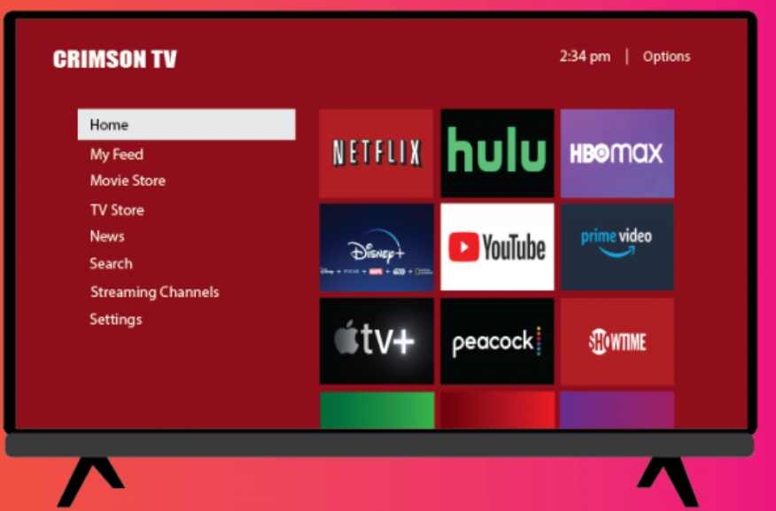
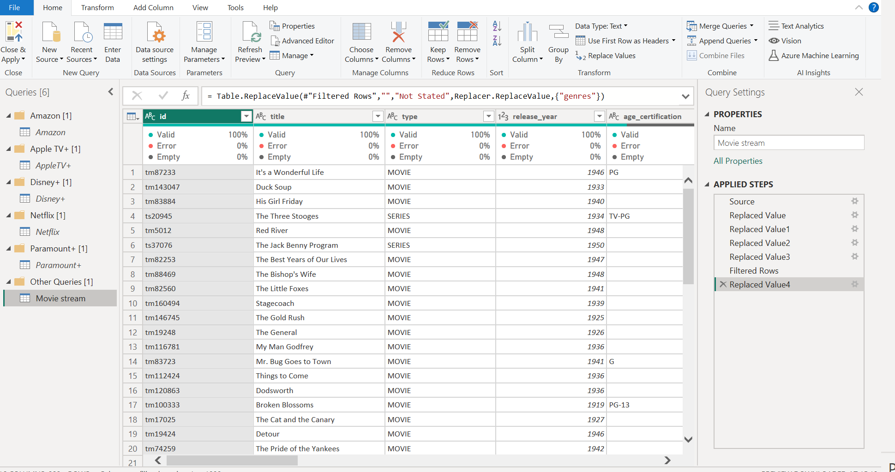
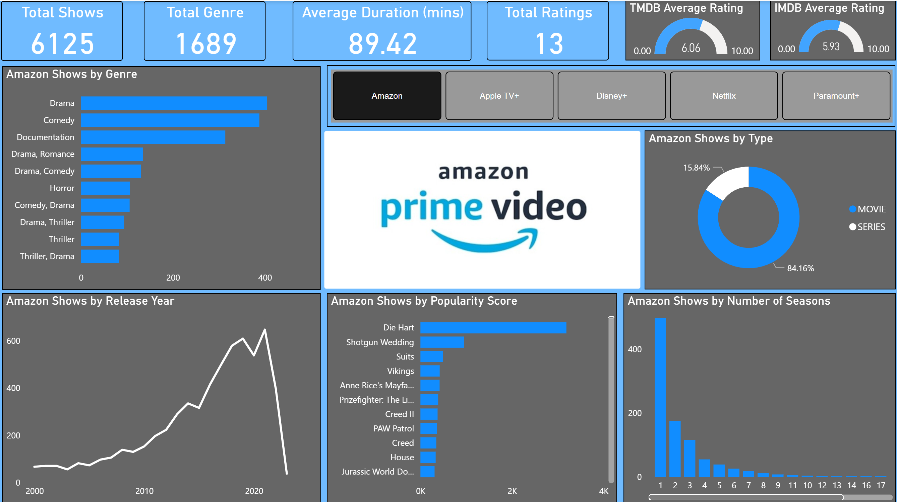
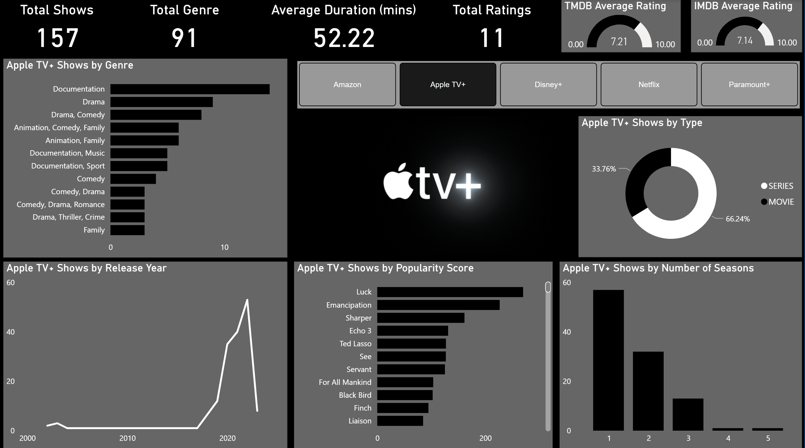
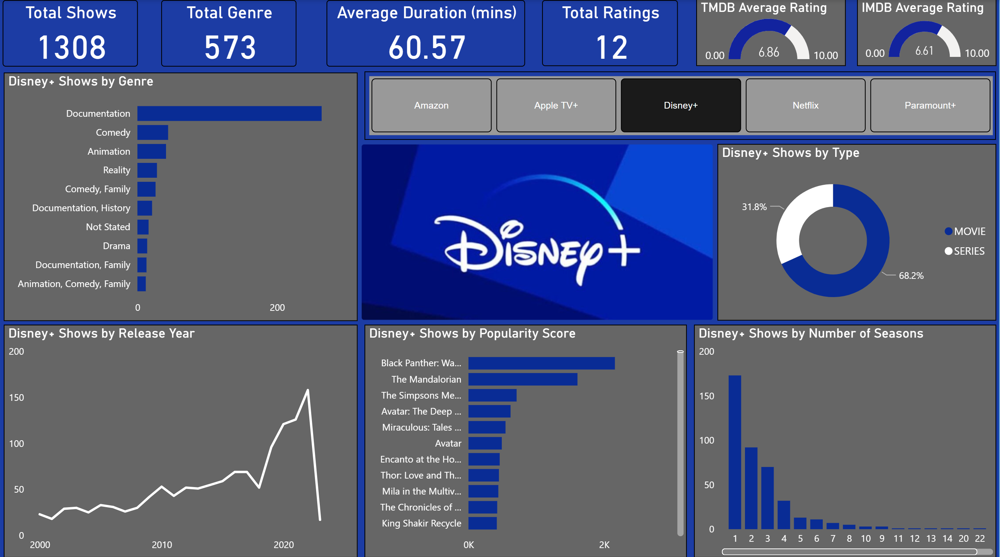
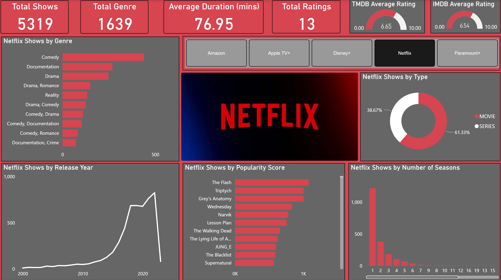
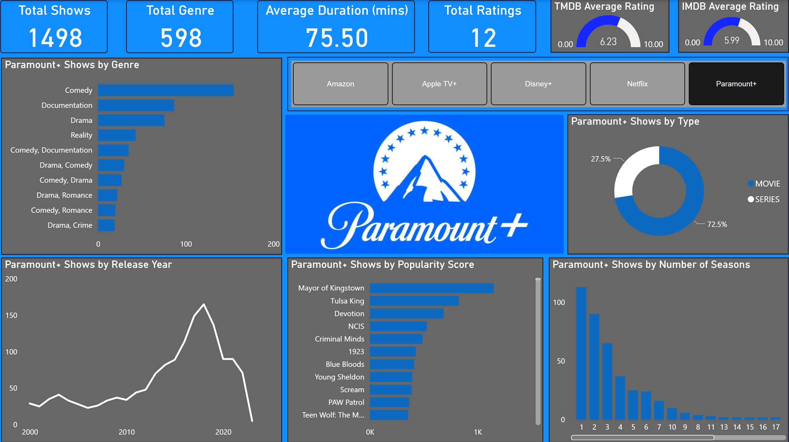

# Movie-platforms Analysis

## Introduction
This is a power BI project on movie streams to improve streaming experiences. The dashboard combines the features of well-known streaming services like **Netflix, Amazon Prime, Paramount+, Apple TV+, and Disney+** to analyse, transform and derive insights to answer key questions and make informed decisions about finding great content while staying within your budget a real challenge. The dashboard for our movie streaming service does precisely that whether you're a movie aficionado, a binge-watcher, or a TV series enthusiast.

**_Note_**: _All datasets range between January 2000 and March 2020 as this may not reflect movies released beyond this period._ 

## Problem Statement
Problem statement:
1. What is the most common genre among movies on each streaming platform?
2. What is the total number of movies available on each streaming platform?
3. What is the average runtime of movies available on each platform?
4. Which movie has the highest popularity score per platform?
5. What is the average number of seasons for series on each platform?

## Skills demonstrated
The following Power BI features were incorporated:
- Filters,
- DAX,
- Data staging,
- Calculated columns,
- Appending queries,
- Merging queries
- Slicer
- Data profiling
## Modelling
Data modelling is not required as the dataset consists of only one table.

## Transformation
The dataset was transformed using several applied steps such as promoting the header, changing data types, removing error rows, replacing null values, capitalising each word, combining rows and columns.

Data Transformation
:------------------:

## Visualisation
The report is one-paged which embeds five different components using slicers to display visuals according to the streaming platforms below:
1. Amazon
2. Apple TV+
3. Disney+
4. Netflix
5. Paramont+
The report can be accessed and interacted with [here](https://app.powerbi.com/view?r=eyJrIjoiMjZhYmRiYTctNWYzMi00NjUxLWEwZDktMDFiZjhiZWU5ZmFiIiwidCI6IjUwZDg2NTA3LWJiZjQtNGZlNi1iMTllLTdkMzM5YTMyZmMyYiJ9)

## Analysis
### Amazon: 

There are a total of 6125 shows of which comprises 5155 movies (84.16%) and 970 series (15.64%) with an average duration of 1.65 hours and 38.88 minutes repectively. Amazon prime is dominated by Drama, Comedy and Documentary genre respectively. Most of the series on the plaforms are single season as the numbers of series declines with an increasing number of seasons.  There has been a consistent growth in the number of shows released over the years except in 2020 when COVID-19 impacted activities globally.  

### Apple TV+: 

There are a total of 157 shows of which comprises 53 movies (33.76%) and 104 series (66.24%) with an average duration of 1.45 hours and 34.51 minutes respectively. Apple TV+ is dominated by Documentation, Drama and Comedy drama genre respectively. The maximum number of season in a series is 5 and most of the series on the plaforms are single season as the numbers of series declines with an increasing number of seasons. There is a stagnation period betwwn 2004 and 2017 where one movie was produced per year before experiencing yearly growth in production till date.

### Disney+: 

There are a total of 1308 shows of which comprises 892 movies (68.2%) and 416 series (31.8%) with an average duration of 1.27 hours and 31.82 minutes respectively. Disney+ is dominated by Documentation, Comedy and Animation genre respectively. Most of the series on the plaforms are single season as the numbers of series declines with an increasing number of seasons. There has been a consistent growth in the number of shows released over the years except in 2020 when COVID-19 impacted activities globally. 

### Netflix: 

There are a total of 5319 shows of which comprises 3262 movies (61.33%) and 2057 series(38.67%) with an average duration of 1.68 hours and 39.60 mins repectively. Netflix is dominated by Comedy, Documentary and Drama genre respectively. Most of the series on the plaforms are single season as the numbers of series declines with an increasing number of seasons. There has been a consistent growth in the number of shows released over the years except in 2020 when COVID-19 impacted activities globally.  

### Paramount+: 

There are a total of 1498 shows of which comprises 1086 movies (72.5%) and 412 series(27.5%) with an average duration of 1.53 hours and 33.18 mins repectively. Paramount+ is dominated by Comedy, Documentary and Drama genre respectively which is identical to that of Netflix. Most of the series on the plaforms are single season as the numbers of series declines with an increasing number of seasons. There has been a consistent growth in the number of shows released over the years but there has been a sharp decline since 2018.  

## Conclusions and Recommendation
### Conclusions
- All platforms have experienced consistent growth⬆️ in the number of shows released over the years, with a temporary slowdown in 2020, likely due to the global impact of COVID-19😞. 
- Amazon, Disney+, Netflix and Paramount+ offer a higher percentage of movies, while Apple TV+ focuses more on series. This composition reflects the platforms' content strategies. 
- The average duration⏲️ of movies on these platforms is fairly consistent, with minor variations. Disney+ have the shortest movies average average duration while Netflix has the longest. For series, Netflix tops the the average duration while Disney+ has the shortest series duration on an average. 
- Most series on these platforms are single-season, and the number of series declines as the number of seasons increases. This suggests that there is a preference for limited-series content. 
- Apple TV+ experienced a period of stagnation in production between 2004 and 2017, with only one movie produced per year. This indicates a significant change in strategy or focus during those years.
- Paramount+ has shown a decline⬇️ in production since 2018, which may indicate a need for content expansion or revitalization. :

### Recommendations
- Read reviews and check ratings on platforms like IMDb or TMdB ast this can give you an idea of the overall quality and reception of the content.
- Take into account your personal preferences in terms of genres, themes, and content type. Choosing content that aligns with your interests is more likely to result in an enjoyable viewing experience.
- Be mindful of the watching duratio as some content may be shorter and more suitable for a quick viewing, while others require a longer time commitment.

